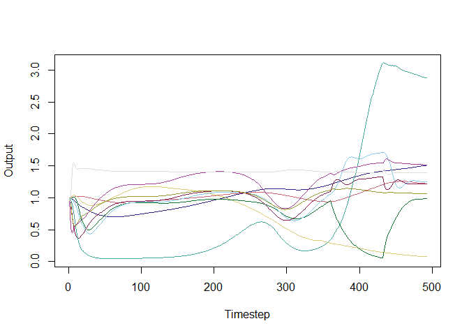

<!-- README.md is generated from README.Rmd. Please edit that file -->

# ecocx

<!-- badges: start -->

[](https://lifecycle.r-lib.org/articles/stages.html#experimental)
<!-- badges: end -->


EcoCX enables computational experiments with Ecopath with Ecosim and
Ecospace (EwE) models.

It contains functions to:

- read an EwE model
- create alternative inputs for, e.g., fishing effort time series and
  environmental drivers like projected ocean warming
- design computational experiments, i.e., repeated model runs that
  systematically change the inputs to learn about their effects and
  interactions
- execute the computational experiments by invoking the new (not yet
  published!) EwE Run Console
- summarize, visualize, and analyze the outputs of the model runs

For example, EcoCX might be used to quantify the effects of different
nature conservation actions (e.g., creating spatial no-fishing zones
versus a generic reduction in fishing effort), or to quantify how much
fishing and climate change interact in a simulated food web.

For example, EcoCX might be used to quantify the effects of different
nature conservation actions (e.g., creating spatial no-fishing zones
versus a generic reduction in fishing effort), or to quantify
interactions how fishing and climate change interact in a simulated food
web.

Supported experimental designs include:

- Random Monte Carlo. For batch-running EwE models, e.g., to generate
  input-output vectors for supervised machine learning
- Elementary effects, aka the Morris method, for identifying the inputs
  that have the largest effect on selected outputs with few model runs
- Full factorial experiments, for decomposing the variance of one or
  more model outputs into direct and interaction effects of each input

At present, EcoCX allows changing fishing effort time series and
environmental drivers in Ecosim. Outputs that can be read or
species/group biomasses and fishery landings. Functions to change other
inputs like mediation functions and Ecospace input maps are in the test
phase and are scheduled for release in the autumn 2026. Additional
experimental designs are planned for 2027. Meanwhile, users are free to
create their own experimental designs, output indicators, etc.

At present, EcoCX allows changing fishing effort time series and
environmental drivers in Ecosim. Functions to change other inputs like
mediation functions and Ecospace input maps are in the test phase and
are scheduled for release in the autumn 2026. Additional experimental
designs including variance-based sensitivity analyses (Sobol indices)
and stratified sampling approaches (like Latin Hypercube Sampling) are
planned for 2027. Meanwhile, users are free to create their own
experimental designs.

Because the EwE Run Console - in essence, a command line interface to
EwE - is not yet published, you’ll need to request an executable from
the Ecopath International Initiative (www.ecopathinternational.org) to
actually run the computational experiments.

## Installation

You can install the development version of EcoCX like so:

``` r
remotes::install_github("anstoc/ecocx")
```

## Example

This is a basic example running Monte Carlo simulations modifying
fishing effort and temperature in an example model:

``` r
library(ecocx)
## load example Ecosim model
xml_model=paste0(get_path_to_exampledata(),"anchovy_bay_ecosim_ex.eiixml")
m=load_model_from_xml(xml_model)

#see the functional groups and fleets
m$ecopath$basic_estimates
#>    GroupID Sequence     GroupName Biomass         PoB   QoB  EE
#> 2        2        1        Whales  0.0800   0.0500000  9.00  NA
#> 3        3        2         Seals  0.0609   0.1539000 15.00  NA
#> 4        4        3           Cod  3.0000   0.3100000  2.58  NA
#> 5        5        4       Whiting  1.8000   0.5810000  3.10  NA
#> 6        6        5      Mackerel  1.2000   0.7233334  4.40  NA
#> 7        7        6       Anchovy  7.0000   1.2000000  9.13  NA
#> 8        8        7        Shrimp  0.8000   3.0000000    NA  NA
#> 9        9        8       Benthos      NA   3.0000000    NA 0.6
#> 10      10        9   Zooplankton 14.8000  35.0000000    NA  NA
#> 11      11       10 Phytoplankton 18.0000 120.0000000    NA  NA
#> 1        1       11      Detritus 10.0000          NA    NA 0.0

m$ecopath$fleets
#>   FleetID  FleetName
#> 1       1    Sealers
#> 2       2   Trawlers
#> 3       3    Seiners
#> 4       4 Bait boats
#> 5       5  Shrimpers

##create a set of factors (inputs that change in each model run): +/- 20% effort for the model's five fishing fleets 
factor_set=new_ecosim_factor_set(m)

factor_set=add_option_ecosim_effort(factor_set,"Sealers","higher20p",1.2*factor_set$fishing_effort$Sealers$default$values,factor_value=1.2)
factor_set=add_option_ecosim_effort(factor_set,"Sealers","lower20p",0.8*factor_set$fishing_effort$Sealers$default$values)
factor_set=add_option_ecosim_effort(factor_set,"Trawlers","higher20p",1.2*factor_set$fishing_effort$Trawlers$default$values)
factor_set=add_option_ecosim_effort(factor_set,"Trawlers","lower20p",0.8*factor_set$fishing_effort$Trawlers$default$values)
factor_set=add_option_ecosim_effort(factor_set,"Seiners","higher20p",1.2*factor_set$fishing_effort$Seiners$default$values)
factor_set=add_option_ecosim_effort(factor_set,"Seiners","lower20p",0.8*factor_set$fishing_effort$Seiners$default$values)
factor_set=add_option_ecosim_effort(factor_set,"Baitboats","higher20p",1.2*factor_set$fishing_effort$Baitboats$default$values)
factor_set=add_option_ecosim_effort(factor_set,"Baitboats","lower20p",0.8*factor_set$fishing_effort$Baitboats$default$values)
factor_set=add_option_ecosim_effort(factor_set,"Shrimpers","higher20p",1.2*factor_set$fishing_effort$Shrimpers$default$values)
factor_set=add_option_ecosim_effort(factor_set,"Shrimpers","lower20p",0.8*factor_set$fishing_effort$Shrimpers$default$values)

summary(factor_set)
#>                 type                  name options
#> 1             tables         foraging_resp       1
#> 2             tables             mediation       1
#> 3             tables         vulnerability       1
#> 4     fishing_effort               Sealers       3
#> 5     fishing_effort              Trawlers       3
#> 6     fishing_effort               Seiners       3
#> 7     fishing_effort             Baitboats       3
#> 8     fishing_effort             Shrimpers       3
#> 9  forcing_functions             PPanomaly       1
#> 10 forcing_functions               Tbottom       1
#> 11            shapes Seal-Mackerel-Anchovy       1
#> 12            shapes              Tempcold       1
#> 13            shapes              Tempwarm       1
#> 14            shapes              Twhiting       1

#create experimental design: random Monte Carlo with 10 runs
set.seed(125)
design_mc=sampler_random(factor_set,size=10)

design_mc
#>    run_id sub_id   run_name               comment foraging_resp mediation
#> 1    0001   0000 R0001_0000  Random sample, run 1       default   default
#> 2    0002   0000 R0002_0000  Random sample, run 2       default   default
#> 3    0003   0000 R0003_0000  Random sample, run 3       default   default
#> 4    0004   0000 R0004_0000  Random sample, run 4       default   default
#> 5    0005   0000 R0005_0000  Random sample, run 5       default   default
#> 6    0006   0000 R0006_0000  Random sample, run 6       default   default
#> 7    0007   0000 R0007_0000  Random sample, run 7       default   default
#> 8    0008   0000 R0008_0000  Random sample, run 8       default   default
#> 9    0009   0000 R0009_0000  Random sample, run 9       default   default
#> 10   0010   0000 R0010_0000 Random sample, run 10       default   default
#>    vulnerability   Sealers  Trawlers   Seiners Baitboats Shrimpers PPanomaly
#> 1        default  lower20p   default   default  lower20p higher20p   default
#> 2        default  lower20p higher20p   default  lower20p   default   default
#> 3        default   default  lower20p   default  lower20p higher20p   default
#> 4        default   default   default higher20p   default   default   default
#> 5        default higher20p   default  lower20p   default   default   default
#> 6        default  lower20p  lower20p  lower20p  lower20p   default   default
#> 7        default   default   default   default higher20p higher20p   default
#> 8        default  lower20p  lower20p higher20p higher20p higher20p   default
#> 9        default higher20p   default higher20p higher20p   default   default
#> 10       default  lower20p higher20p higher20p higher20p higher20p   default
#>    Tbottom Seal-Mackerel-Anchovy Tempcold Tempwarm Twhiting
#> 1  default               default  default  default  default
#> 2  default               default  default  default  default
#> 3  default               default  default  default  default
#> 4  default               default  default  default  default
#> 5  default               default  default  default  default
#> 6  default               default  default  default  default
#> 7  default               default  default  default  default
#> 8  default               default  default  default  default
#> 9  default               default  default  default  default
#> 10 default               default  default  default  default

#connect to EwE Run Console. Note that at present, you'll need to obtain the executable via a request to the Ecopath International Initiative.
ewe_link=ecocx::connect_to_ewe("C:/Users/ANC/OneDrive - NIVA/Projects/2025/2025CLIMAX/WP1/TestRunConsole/EwERunConsole-1.0.32/EwERunConsole.exe")

#optional: use future.apply library for parallel processing
library(future.apply)
#> Loading required package: future
plan(multisession)

#run the model repeatedly according to the design!
cx_table=run_ecosim_experiment(design_mc,xml_model,factor_set,ewe_link,paste0(tempdir(),"/mctest"),parallel=T)

#obtain biomasses
df_cx=get_ecosim_cx_biomass(cx_table, m,relative=T)

#plot the 10 runs. Colors are species groups.
plot_all_runs(df_cx,alpha=0.2)
```



    #> NULL
